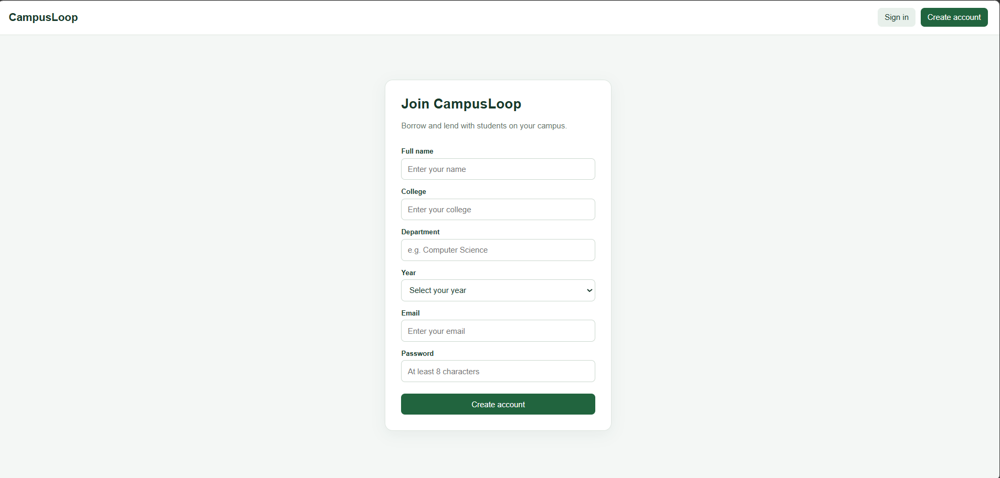
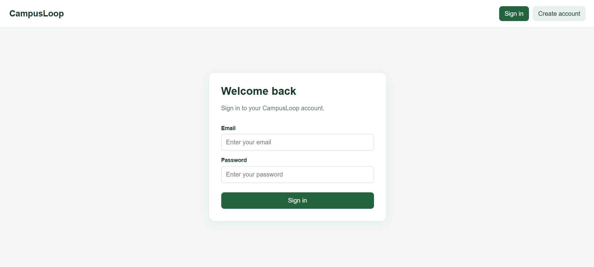
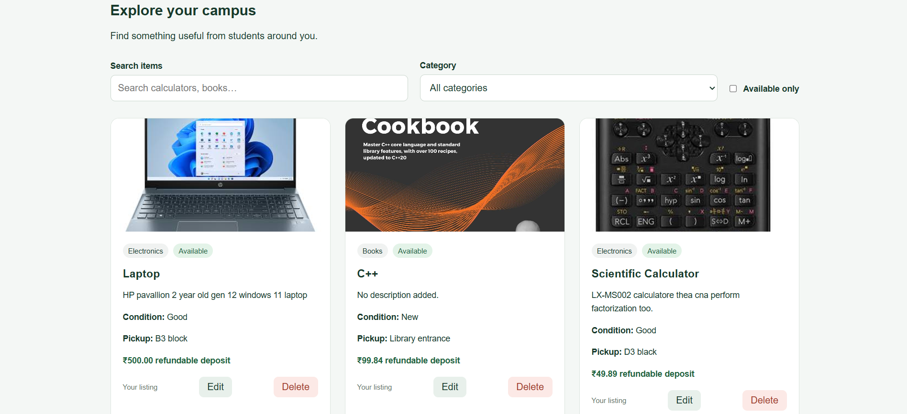
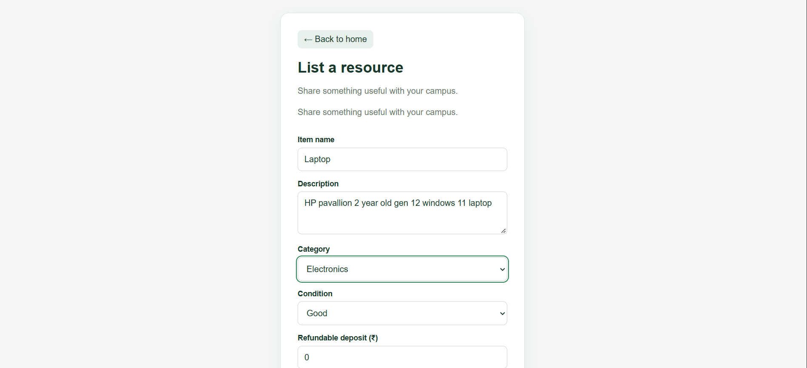
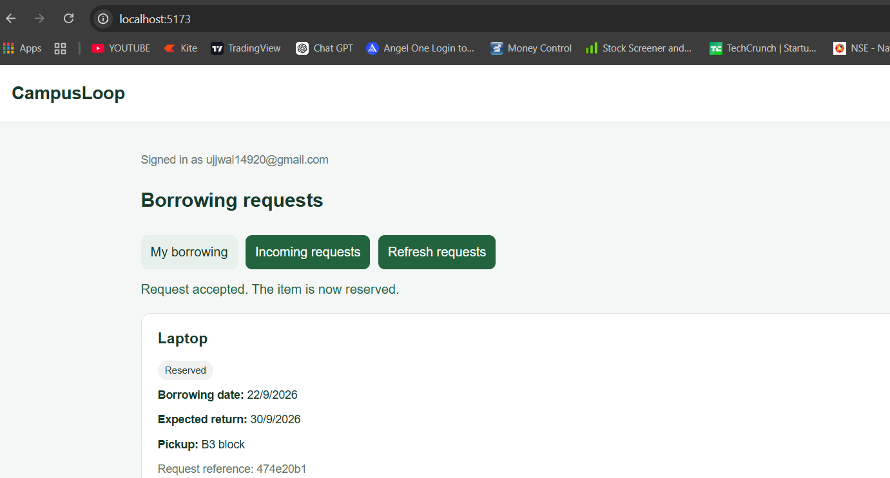

# CampusLoop 🎓

A campus resource exchange platform where students can list items,
discover resources, and request to borrow from other students at
their college.

Built for the AI Full Stack Sprint hackathon.

## Features

- Student signup, email confirmation, signin, and logout
- Student profiles created automatically during registration
- Resource creation, editing, and deletion by the owner
- Search by item name and filter by category or availability
- Refundable deposits displayed in Indian rupees (₹)
- Borrowing requests with start and expected return dates
- Owner approval and rejection of requests
- Borrower and owner request dashboards
- Accepted requests reserve the item and mark it unavailable
- Persistent data and database-enforced access rules

## Tech Stack

| Layer | Technology |
|-------|------------|
| Frontend | React + Vite |
| Styling | CSS |
| Backend | Supabase APIs and PostgreSQL functions |
| Database | PostgreSQL through Supabase |
| Authentication | Supabase Auth |
| Authorization | Row Level Security and database permissions |

## Screenshots

### Signup

Students register with their name, college, department, year,
email, and password.

### Signin

Registered students sign in using their email and password.

### Home

Browse campus resources, search for items, and filter listings
by category and availability.

### Add Item

List a resource with its description, category, condition,
deposit, pickup location, availability, and optional image URL.

### Borrowing Dashboard

Borrowers track their requests. Item owners review incoming
requests and accept or reject them.

## How It Works

1. A student registers and confirms their email if required.
2. Their student profile is created automatically.
3. The student lists an item with its pickup location and optional deposit.
4. Another student from the same college finds the item.
5. The borrower selects dates and submits a request.
6. The owner accepts or rejects the request.
7. An accepted request becomes Reserved, and the item becomes unavailable.
8. Both students can view the request status and expected return date.

## Run Locally

### 1. Clone the repository

    git clone https://github.com/ujjwal149/Campusloop.git
    cd Campusloop

### 2. Install dependencies

    npm install

### 3. Configure Supabase

Create a `.env.local` file beside `package.json`:

    VITE_SUPABASE_URL=your_supabase_project_url
    VITE_SUPABASE_PUBLISHABLE_KEY=your_supabase_publishable_key

Get these values from your Supabase project's Connect panel.

Use only the publishable key in the frontend. Never include a
Supabase secret or service-role key.

The `.env.local` file is ignored by Git.

### 4. Prepare the database

The app requires:

- `profiles` table
- `resources` table
- `borrow_requests` table
- Automatic profile creation trigger
- Row Level Security policies and table permissions
- `is_same_college` database function
- `respond_to_borrow_request` database function
- Unique indexes preventing duplicate open requests and multiple active loans

The SQL has been applied to the team's shared Supabase project.
It is not currently included as migration files in this repository.

For a separate Supabase project, obtain and apply the complete
schema, functions, and access policies before testing the app.

### 5. Start the app

    npm run dev

Open the local URL printed in the terminal.

After changing `.env.local`, restart the development server.

## Working With the Shared Database

Team members should use the same Supabase project URL and
publishable key in their own local `.env.local` files.

There is no need to create another database or rerun the setup SQL
when connecting to the existing team project.

Each teammate should register with their own email address.
Use the same college name to test campus resource sharing.

## Database Overview

| Table | Purpose |
|-------|---------|
| `profiles` | Student details and account roles |
| `resources` | Listings, ownership, availability, and deposit amounts |
| `borrow_requests` | Borrowers, requested dates, and loan statuses |

## Access Rules

- Students can read and update their own profiles.
- Students cannot promote themselves to admin.
- Listings are visible to their owner and students from the same college.
- Only the owner can edit or delete a listing.
- Students cannot request their own items.
- Borrowers and item owners can view the relevant requests.
- Only the item owner can accept or reject a request.
- An item can have only one reserved or active loan at a time.
- Items with borrowing history cannot be permanently deleted.

College names are self-entered; institutional membership is not
independently verified.

## Test the Core Flow

1. Register Student A and Student B with different email addresses
   and the same college name.
2. Confirm both email addresses if confirmation is enabled.
3. As Student A, list a calculator with a ₹100 deposit.
4. As Student B, find it and submit a borrowing request.
5. As Student A, open Incoming requests and accept it.
6. Confirm that the request is Reserved and the item is unavailable.
7. As Student B, open My borrowing to check the updated status.

Use Refresh requests to see changes made in another browser session.

## Current Scope

- Item images are entered as URLs; file upload is not implemented yet.
- Deposits are informational; payments are handled outside the app.
- Requests refresh manually rather than in real time.
- Reservations block the item entirely, including other date ranges.
- Handover and return buttons are not yet connected to the interface.
- Admin dashboard and item reporting are planned.

## Planned Improvements

- Handover and return tracking
- Student profile editing screen
- Image uploads
- Admin dashboard and reported-item management
- QR-based handover
- Database migrations stored in the repository

## Repository

[View CampusLoop on GitHub](https://github.com/ujjwal149/Campusloop)